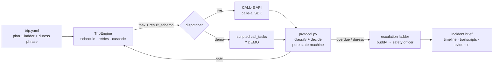

# FieldLine

**A lone-worker safety net that phones the field.** Scheduled check-in
calls, a silent duress phrase, and an automatic escalation call cascade —
one agent watching every trip plan, built on the
[CALL-E](https://docs.heycall-e.com/) phone-call platform.

> I do marine fieldwork on the Red Sea coast. Our field-safety plan is a
> PDF and a promise that someone will notice if we don't come back. At
> 18:05, nobody is watching the clock. FieldLine is the thing that
> watches the clock — and it has a phone.

## What it does

1. **You file a trip plan** (`examples/trip.yaml`): who, where, check-in
   times, an escalation ladder (buddy → safety officer), and a
   pre-agreed **duress phrase**.
2. **FieldLine calls you at each check-in.** CALL-E holds the
   conversation and returns a structured result (`safe` /
   `needs_assistance` / duress flag / location / plan changes).
3. **Miss a check-in?** Retry after 5 minutes → declared OVERDUE →
   FieldLine climbs the ladder call by call, briefing each contact with
   accumulated facts (last confirmed contact, vehicle, what the previous
   contact said) until a human explicitly assumes coordination.
4. **Say the duress phrase mid-call?** The agent doesn't flinch — ends
   the call normally — and silently escalates straight to the top rung,
   with instructions not to call your phone back.
5. Every incident produces a **written brief**: timeline, transcripts,
   structured results, evidence, recommended actions.

FieldLine **never auto-dials emergency services** — the last rung is
always a human who does.

## Quickstart (demo mode — no account, no keys)

Requires Python ≥3.12 and [uv](https://docs.astral.sh/uv/).

```bash
uv sync
uv run fieldline demo                      # golden path: safe check-in → missed → cascade
uv run fieldline demo --scenario duress    # the silent-duress beat
uv run fieldline report                    # re-read the latest incident brief
uv run pytest -q                           # 32 unit tests
```

Demo mode replays scripted calls with realistic transcripts (marked
`// DEMO` in the source; all people and +1-555-01xx numbers are
fictional). The dicts it returns follow CALL-E's real `call_task` schema
(from the [OpenAPI spec](https://docs.heycall-e.com/openapi/calle.openapi.yaml)),
so everything above the transport layer is exercised for real.

## Going live (real phone calls)

```bash
uv sync --extra live                # installs the calle-ai SDK
cp .env.example .env                # put your CALLE_API_KEY inside
# edit examples/trip.yaml → your own numbers, in E.164
uv run fieldline checkin-now examples/trip.yaml   # ONE real test call to yourself
uv run fieldline start examples/trip.yaml         # monitor the whole trip
uv run fieldline end                              # cancel: stops all future calls
```

Get a key: create an account at <https://www.heycall-e.com/> (20 free
calls), then <https://dashboard.heycall-e.com/account/api-keys>.

The only difference between demo and live is the transport
(`src/fieldline/calle_client.py`): live mode calls
`client.calls.create_and_wait(...)` from the official `calle-ai` SDK
with the same task prompts, the same `result_schema`s, and idempotency
keys so a retried request can never double-dial anyone. Live calls
require typing `LIVE` at a consent gate (or `--yes`).

## Architecture



- **CALL-E does the talking.** Each call is one `POST /v1/calls` with a
  natural-language `task` and a JSON `result_schema`; the platform
  plans, dials, converses, and returns `structured_result`,
  `task_completed`, `completion_confidence`, and `evidence`.
- **FieldLine does the policy.** `protocol.py` is a deterministic,
  unit-tested state machine — no LLM in the loop, so safety decisions
  are reproducible. Duress overrides a stated "safe"; an unreachable
  API degrades to the no-answer path (fail-soft) instead of crashing
  the safety loop.
- **The silent-duress trick** is pure prompt + schema: the `task` tells
  the agent to never react to the phrase, and
  `duress_phrase_detected: boolean` rides back in the structured result.

## Safety design

- Consent gate before any live call; `fieldline end` cancels a trip
  (cancellation is honored between calls).
- Duress protocol never re-contacts the worker.
- Emergency services are never auto-dialed; the brief tells the human
  coordinator who to call.
- Phone numbers are masked in all output and reports.

## Repo map

```
src/fieldline/     engine, protocol (state machine), dispatchers, prompts, rendering
examples/trip.yaml sample trip plan (fictional numbers)
tests/             32 tests: protocol policy, dispatcher shape-conformance, full scenarios
scripts/demo-reset one-command reset to a clean demo state
docs/              hackathon docs (idea brief, plan, submission, video script)
```

## AI tools used

Built with AI coding assistance (Claude) during the hackathon window;
design, review, and verification by the author. Demo transcripts are
hand-written simulation data and marked as such. See `docs/ai-usage.md`.

## License

MIT — see [LICENSE](LICENSE).
